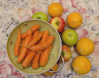
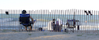
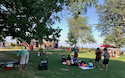
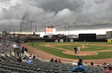

<!DOCTYPE html>
<html>

<head>
  <meta charset="utf-8">
  <title>Summer Weekends Home</title>
  <meta content="width=device-width, initial-scale=1, maximum-scale=1" name="viewport" />
  <link rel="stylesheet" href="css/index.css">
</head>

<body>
  

    <header class="header">
      
SUMMER WEEKENDS

      

        <a class="active" href="#home" aria-label="Navigation">Home</a>
        <a href="#news" aria-label="Navigation to News">News</a>
        <a href="#contact" aria-label="Navigation to Contact">Contact</a>
        <a href="#about" aria-label="Navigation to About">About</a>
      

    </header>

    

      

        
        

          
Farmers' Market

          

            Lorem ipsum dolor sit amet, consectetur adipisicing elit,
            sed do eiusmod tempor incididunt ullamco laboris nisi ut aliquip.
          

          <button class="button" onclick="document.location='topic.html'">Card link</button>

        

      

    

    

      

        
        

          
Beaches

          

          

            Lorem ipsum dolor sit amet, consectetur adipisicing elit,
            sed do eiusmod tempor incididunt ullamco laboris nisi ut aliquip.
          

          <button class="button" onclick="document.location='index.html'">Card link</button>
        

      

    

    

      

        
        

          
Parks

          

          

            Lorem ipsum dolor sit amet, consectetur adipisicing elit,
            sed do eiusmod tempor incididunt ullamco laboris nisi ut aliquip.
          

          <button class="button" onclick="document.location='index.html'">Card link</button>
        

      

    

    

      

        
        

          
Baseball

          

            Lorem ipsum dolor sit amet, consectetur adipisicing elit,
            sed do eiusmod tempor incididunt ullamco laboris nisi ut aliquip.
          

          <button class="button" onclick="document.location='index.html'">Card link</button>
        

      

    

    <footer class="footer">
      

        
 REFERENCES:

        
 1. <a href="https://gridbyexample.com/patterns/">Layout design for the content of these pages was based upon templates by Rachel Andrews, "Grid By Example"</a>

        
 2. <a href="https://ya-webdesign.com">Avatar on Post page, YAWD website</a>

        
 3. <a href="https://stackoverflow.com/">Stack Overflow for clues</a>

        
 4. <a href="https://www.w3schools.com/w3css/w3css_buttons.asp">WC3 Buttons</a>

        
 5. <a href ="https://www.w3schools.com/howto/howto_js_topnav.asp">WC3 Navbar</a>

        
 6. <a href="https://css-tricks.com/radial-gradient-recipes/">Radial Gradient Recipes - CSS Tricks</a>

        
 7. <a href="https://drafts.csswg.org/css-cascade/#at-import">CSS Cascading and Inheritance Level</a>

        
 8. <a href="https://www.lullabot.com/articles/what-heck-aria-beginners-guide-aria-accessibility">Aria & Accessibility</a>

        
 9. <a href="https://developer.mozilla.org/en-US/docs/Web/Accessibility/ARIA/ARIA_Techniques/Using_the_aria-label_attribute">Aria Labels Code Example</a>

        
10. <a href="https://www.youtube.com/watch?v=0hqhAIjE_8I">How to Use Chrome Vox to Check for Accessibility</a>

      

      

        
        
        
        
      

    </footer>
  

</body>

</html>
